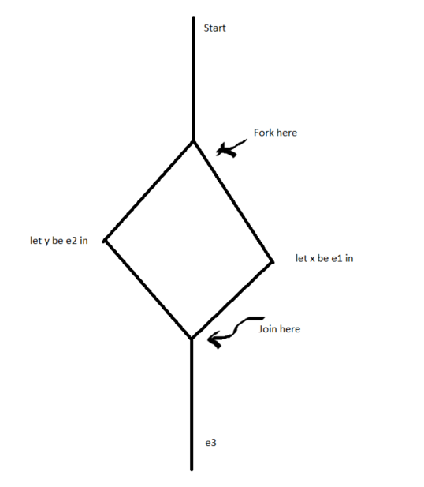

Firstly, let's nail down what parallelism is. Parallelism is, namely, a performance  optimization. By running multiple things **at the same time**, we're able to get stuff done quickly. 

Now, while that's a great idea in theory, in practice we simply cannot run all lines at the same time. If we consider the following program, for example:

```ocaml
let x be e1 in
let y be e2 in
e3
```

where e3 depends on both e1 and e2. 

If we were to blindly run the first two lines in parallel, we could easily run into trouble. If `e1` depended on `y` or `e2` depended on `x` , or if either line had some sort of side-effect, we could easily create a non-deterministic program, depending on your scheduler. (However, if `e1` and `e2` have no side effects or data dependency then they'd be trivially parallelisable, which is the motivation behind stuff like MapReduce)

Thus, while we'd like to have our programs automatically run in parallel, it's probably for the best we give the program some functionality regarding parallelism instead, and let the programmer handle the nontrivial parallelisation. To do so, let's introduce the first kind of parallelism we'd like to study: Fork-Join Parallelism

---

# Fork-Join Parallelism

Here, the idea behind fork and join parallelism is rather simple. If we have a program, like the above statement, where we knew we could run two things in parallel, we could start a program that runs both of the sub-programs in parallel ( a fork ), and a program that takes both of the sub-programs and combines them for `e3`  ( a join ). With both of these constructs, we'd be able to give the programmer the ability to run both programs at once, like the diagram below:



Thus, when we run the sections in parallel, and then join them, our program's execution, hopefully, is not changed, and we're able to get some performance benefits, though it's still a bit hard to say what sorts of performance benefits we get out of this, so let's make it clear.

- Firstly, this doesn't change the total amount of *work* in the program. We change how the computational steps are processed; we do not change the amount of work we do.
- However, because we change the order of execution, we change the *depth* of the program, which is the amount of work on the critical path through the graph. This is essentially the work that'll determine the time our program takes to run, and thus is what we wish to optimize to speed up our programs.

It turns out, we can compute these expressions (  *work* and *depth* ) through an underlying *cost semantics*, which is a fancy way we can formalize the time complexity of a set of operations:

*Cost Semantics:*  A way for us to describe the *work* and *depth* of a program, given "costs" which, for this class, are values associated with the number of operations (i.e. the time) we need to take for some operation to be complete. 

So, for example, let's say we gave the cost of starting the program as `1` , the cost of `let x be e1` as 2, the cost of `let y be e2` as 3, and the cost of computing  `e3`  as `1` . 

In this case, the work is simply the number of operations we need to compute, so it's the sum of all of our costs, namely `1+2+3+1` , or `7` .

However, the depth for this process is the length of the largest path from the start of computation to the end of computation. In this case, it's going to be `1 + max(2,3) + 1` , which is `4` . 

Thus, with fork-join parallelism, we're able to get a performance increase, while still hacing the same amount of work.

As we can see, by quantifying the explicit parallel costs for this program, we can calculate the approximate speedup of our program, and see if it's worth putting our original program in parallel in this manner, as sometimes you'll want to use a different syntax or a different system to speedup your program. 

Key Idea: Scheduling doesn't change the **computation**, but it does change **performance**, depending on your system and your constructs.

Now, this wouldn't be a 490 class if we didn't try to extend this useful concept to ALFA, so let's add it in and see what happens!

---

### Onto the formalism for forking and joining

So, we'll create a new language ALFA + Forks, which will denote ALFA with a forking construct. 

For once, we don't need to add anything to our type system. As we're changing the computation we perform / we can perform, we only need to add something to our expression language, which tells us that we're about to run two statements in parallel:

```ocaml
e ::= ...
   | Fork(e1, e2, x.y.e3)               fork x=e1 and y=e2 in e3
```

Now that we've added a term to our expression language, we'll obviously need to figure out the static semantics of such a term, which are the following:

$$\frac{\Gamma \vdash e_1 : \tau_1 \text{\ \ \ } \Gamma \vdash e_2 : \tau_2 \text{\ \ \ } \Gamma, x: \tau_1, y: \tau_2 \vdash e_3 : \tau }{\Gamma \vdash \text{ fork x = }e_1\text{ and y=}e_2\text{ in }e_3:\tau}$$

This makes sense, as we're running two expressions in parallel, which must have some type, and then let-binding them into a third expression, which should have consistent type given the types for `e1` and `e2`

Cyrus also makes it a special point that the design of the assumptions of this rule are very intentional, in that we have the same initial context for our execution of e1 and e2. By doing that, we're enforce that the contexts for both are the same, so when a programmer uses this construct, they have to intend for the two branches to have no dependencies, which is what they intended.

Besides the static semantics for the expression, we'd also like to have the dynamic semantics for it which, for the evaluation rule, is the following:

$$\frac{e_1 \Downarrow v_1 \text{\ \ \ } e_2 \Downarrow v_2 \text{\ \ \ } [\frac{v_1}{x}, \frac{v_2}{y}]e_3 \Downarrow v_3}{\text{fork x = }e_1\text{, y=}e_2\text{ in }e_3 \Downarrow v_3 }$$

Again, this makes sense as, for the sake of **correctness**, we simply need to evaluate both sub-expressions and then subsitute the results into the join expression. 

However, while all of our previous formalism gave us amazing results when it comes to proving correctness, it does not tell us anything about the new functionality of this operation ( after all, one could say this looks like a very complicated let pair expression ), namely that the operations are done in *parallel*. To reason about that, then, we'd like to have a new judgement, that allows us to write about the *costs* of computations, so we can, eventually, reason about how much better parallelising some operation is versus not parallelising it. 

To do so, let's try to formalize the earlier *Cost Semantics,* first by formalizing what **cost** is, and then creating a judgement that tells us how to get the *cost* of expressions:

### Cost Semantics, formalized

Firstly, we need to formalize what cost is, which we'll do recursively as a following:

```ocaml
Cost c ::= 0, which will refer to 0 cost operations (such as simply having `5`)
         | 1, which will refer to unit cost operations, like adding
         | c1 x c2 , where we'll compose two parallel operations with costs c1 and c2
         | c1 + c2 , where we'll run both statements sequentially, with costs c1 and c2
```

Here, it's important to note "x" and "+" do NOT refer to the multiplication and addition operators we're familiar with. Instead, they're arbitrary combining operations. We'll get into more about this later, after we define how cost propogates across expressions

Now, we'll formalize the cost semantics by adding a cost judgement, like the following:

$$e_1 \Downarrow ^c e_2$$

If we had to read this aloud, we'd say that "e1 evaluates to e2 with cost c". This judgement will serve as our formalism computing the time cost of operations and, while we won't go into full details about all of the rules in the system, we'll cover just enough to help aid understanding about how this lets us reason about complexity.

Firstly, and perhaps unsurprisingly, simply having a value is a 0-cost operation:

$$\frac{}{\underline{n}\Downarrow^0 \underline{n}}$$

Which makes sense, as, if you have a simple numeric literal, you can add that to the executable to have it, which is a simple and easy thing to do. 

Secondly, when we have a compound operation, such as adding, we have the following rule:

$$\frac{e_1 \Downarrow^{c_1} \underline{n_1} \text{\ \ \ } e_2 \Downarrow^{c_2} \underline{n_2} }{e_1 + e_2 \Downarrow^{c_1 + c_2 +1 } \underline{n_1 + n_2}}$$

where we combine/"add" the costs of evaluating the subexpressions to get the cost of the total, which makes sense as we're essentially looking to combine all sequential operation costs in a uniform manner. 

Lastly, when we have a fork-join operation, we have the following rule:

$$\frac{e_1 \Downarrow^{c_1} v_1 \text{\ \ \ } e_2 \Downarrow^{c_2}v_2 \text{\ \ \ } [\frac{v_1}{x}, \frac{v_2}{y}]e_3 \Downarrow^{c_3}v_3}{\text{fork x}=e_3 \text{ and } y=e_2 \text{ in } e_3 \Downarrow^{(c_1 * c_2)+1+c_3}v_3}$$

Which, again, makes sense, as we compose e1 and e2 in parallel, then compute e3 sequentially, plus a unit cost from the combination / scheduling the fork-join, as that takes work. 

### Work and Depth from Cost

With these primitives, and similar rules for all of our other operations, we could then get a rigorous definition of **cost**. But, what we're really looking for is a definition of **work,** our sequential operation cost, and **depth**, our parallel operation cost. To get these, we can simply define them by work in the following manner:

Let's define a function, work(c), which takes in a cost expression and computes the numerical work for a computation. As we're trying to grab the cost of all operations, we can define work recursively like this:

```ocaml
work(0) = 0
work(1) = 1
work(c1 x c2) = work(c1) + work(c2)
work(c1 + c2) = work(c1) + work(c2)
```

And, this makes a lot of sense. Here, we turned both parallel composition and sequential composition into simply adding costs, as we simply want to know how many operations we perform.

Now, if we want to define depth, we'd do it in the following way:

```ocaml
depth(0) = 0
depth(1) = 1
depth(c1 x c2) = max(depth(c1), depth(c2))
depth(c1 + c2) = depth(c1) + depth(c2)
```

Here, once again, we get something that makes a lot of sense. If we had a purely sequential computation, the overall work would be the same thing as the depth, so we get no benefit from running operations in parallel versus running them sequentially. However, if we had a parallel computation, we'd be able to save some time, as we'd only have to wait on the longer computation instead of the sum of both computations, demonstrating a parallel **speedup**.

With all of this said and done, while we didn't define ALFA with forks completely, we get the point. Let's see an example of how this construct, fork-join parallelism, can be used to speed up computation dramatically:

---

### Fork Join Parallelism in Context

Or how to use a bunch of guinea pigs *cough* CS students *cough* to get more computation done in marginally faster ways

Let's say we had a tree type, defined in the following way:

```ocaml
type tree = Empty
          | Node of tree * int * tree
```

and, say for an interview, we were tasked with finding the minimum of this tree, which we knew was perfectly balanced through some other constraints.

If the language we were working in had recursion, then we could simply do that in the following manner:

```ocaml
let rec findmin( x : tree ) = 
   match x with 
   | Empty -> 0
   | Node(left, n, right) ->
       let minleft = findmin(left) in
       let minright = findmin(right) in
       min(minleft, min(n, minright))  
```

where we simply check the mins of each subtree, and then compare them with the value at the current node. 

This sequential computation is what's known as something that is *obviously parallelizable*, where we have two computations that could simply be ran in parallel without any major modification to the code. If we simply turn it to the following:

```ocaml
let rec findmin( x : tree ) = 
       match x with 
       | Empty -> 0
       | Node(left, n, right) ->
           fork minleft = findmin(left) and
            minright = findmin(right) in
           min(minleft, min(n, minright))
```

We know, intuitively, that this computation will be faster than the sequential operation, but it remains to be seen just how much *faster* it is. To do so, let's compute both the **work** and **depth** of this computation:

For the **Work,** where findmin(x) is done on a tree with n nodes:

- Firstly, we know that w(0) = 1, as we need to check if the node is empty to do anything
- Secondly, we know that w(n) = the time to match + the time to join + the time of figuring out the min of both branches, each of which has n/2 nodes = 1 + 1 + w(n/2) + w(n/2). Thus, our final equation is simply w(n) = 2 + 2*w(n/2)

As we can see, we have a recurrence relation. Thus, going back to 281, we can use the Master Theorem to get that:

$$w(n) \in O(n)$$

which makes sense, as we have to look through each node, and we need to do a finite number of comparisons for each node to check if its the current minimum or not. 

Now, for the **Depth,** we can do the following:

- Once again, d(0) = 1, as we still need the case expression
- d(n) = 1 + max(depth(n/2), depth(n/2)) + 1, as we're running the recursive step in parallel, so we have two workers check to see if either subtree is smaller instead of doing it ourselves. Thus, d(n) = 2 + depth(n/2), as we have a balanced tree

Here, once again, we can use the Master Theorem to get that:

$$d(n) \in O(\log n)$$

And wow! We did it! We managed to turn a O(n) algorithm into something that takes O(log(n)) time if we had infinitely many processors ( more on this later ). To figure out how well we did, we can compute the **parallelizability ratio** for this computation:

The *parallelizability ratio* for a computation is simply the work on an input of n size over the depth on an input of n size, or w(n)/d(n)

In our case, then, the ratio is:

$$\frac{n}{\log(n)}$$

which, as it's much, much, greater than one, implies that this computation is parallizable, and that we did a great job parallelizing it! Woot!

---

### Bounded Parallelism

However, while we wish we could have our cake and eat it too, we know that, sadly, can't be the case. In real life, we don't have infinitely many processors, we have p processors.

Furthermore, we generally don't even have perfect communication between many processors as the number of processors grows without bound. Thus, it's not just limited processors, but processors that are arranged in graphs who can't communicate to each other all directly, but we'll gloss over this extra caveat for this class.

Here we'll state, without proof, a theorem that demonstrates the potential speedup we can still achieve, known as **Brent's Theorem:**

---

**Brent's Theorem:** If e evaluates to v with cost c, and the work of c is w, while the depth of c is d, then we need:

$$O(\max(w/p, d))$$

time to execute our program, where p is the number of processors. 

---

Thus, for our program, while it's still very parallelizable, we're really going to get the following time complexity if we ran it on our processor-bound computers:

$$O(max(n/p, log(n)))$$

which, as p tends to be very small for most desktops, leads to our program taking the following time:

$$O(n/p)$$

However, if p is large enough for our program, we'd be able to get the full O(log(n)) time cost, make our program reallllllly speedy.

Alternatively, if we had some form of sequential operation, where work and depth are equal, we see that Brent's theorem leads to a time complexity of O(d), or O(w), which makes sense as, in a sequential operation, *d dominates*, i.e. it's too large to make any parallel calls to speed it up (without perhaps changing the algorithm...)

---

### Data Parallelism: Fork-Join Parallelism w/ Vectors

→ Or, how to tame a GPU

Now, as you can guess, Fork-Join parallelism isn't the only way we can do this parallel nonsense.

It turns out, in most micro-architectures and in Graphics Processing Units of nowadays, we have a new form of parallelism called data parallelism. This form of parallelism excels in taking large amounts of data and applying large operations all at once, allowing us to do some crazy matrix and vector operations almost atomically, leading to crazy speedups for scientific and gaming computations, which make use of a lot of this.

For Data Parallelism, we introduce a new type called a *vector:*

```ocaml
tau ::= vec(tau)
```

This will stand for the large lists of numbers such processors work with. Additionally, we'll also introduce the following expressions:

```ocaml
e ::= vec(e1, ... , en)     The introduction form for vectors
     | len(e)               An operation to compute the length of a vector
     | sub(e1,e2)           An operation which lets us grab some element from the vector
     | map(e1,e2)           A Parallel Map Operation
     | tab(e1,e2)           A Parallel Tabulation Operation
```

If you're familiar with the Google Map-Reduce framework, or Hadoop, simply change "tab" to "reduce", as they're equivalent.

Now, let's skip the static and dynamic semantics and go straight to the cost semantics. These are reallly similar to those of fork-join parallelism. For subscripting, it's going to be the following:

$$\frac{e_1 \Downarrow^{c_1} \text{vec(v1, ..., vn)\ \ \ } e_2 \Downarrow^{c2}\underline{i}}{\text{sub(}e_1,e_2) \Downarrow^{c_1 + c_2 + 1} v_i}$$

Like fork-join parallelism, this makes a lot of sense, as this is a unit-cost operation to find an element in a vector, at least conceptually (though you could always adapt this to be more-low level, at the cost of theoretical cleanliness), and as this is simply a sequential operation.

For the parallel map operation, however, it'd be the following:

$$\frac{e_1 \Downarrow^{c_v} \text{vec(}v_1,...,v_n) \text{\ \ \ \ } e_2 \Downarrow^{c_f}\text{fun(x}\rightarrow e_2') \text{\ \ \ \ } f\ v_1 \Downarrow^{c_1}v_1';\ f\ v_2 \Downarrow^{c_2}v_2';\ ...\ ;f\ v_n \Downarrow^{c_n}v_n' }{\text{map(}e_1,e_2) \Downarrow^{c_v + c_f + (c_1 * ... * c_n)}}$$

Which makes sense, as map is essentially just a really, really, large fork-join, applying some function to each element atomically.

Now, this is really, really simple, as it's just an extension of the earlier idea, but this is used in Data-Science frameworks like Google's Map-Reduce, and in creating programs like fragment shaders. It's really useful due to its simplicity, and creating good programs using it is still a hard process.

---

### Futures

→ Or, yet another way to do parallelism

And, lastly, here's a third commonly used way to introduce parallelism: futures!

- The idea here is that, instead of having a function that we **call** in parallel, and then **combine** the function later on, we have a new keyword, `spawn` , which returns a type `future` , which is the result of the computation in parallel.
- Then, when we want to turn this `future` value into a regular value, say to actually use it in a function, we simply call `sync` on the future typed value, which forces our function to wait till that operation is run before proceeding, evaluating the `future` value to it's underlying data type

This is a very common way of doing parallelism for stuff like GUIs on the web, as JS offers a similar primitive called a `Promise` , where we want the main thread of computation to continue running, but we wish to have some code that will run due to some event happening on the user's end.

Here, data dependencies are determined at runtime, which allows us to focus on making sure that the program is right rather than having to worry about ensuring computations run in parallel lack dependencies ( our type checker will complain if we do not sync beforehand ). 

An example of code that would use this primitive is the following:

```ocaml
let x = spawn(e1) in
let y = spawn(e2) in
...
let z = f(5,6) in
z + sync(x) + sync(y)
```

Here, the main function will continue running after x and y are scheduled to run, and only get their value when they are sync-ed, allowing the runtime environment to run them in parallel.

---

### The Formalism of Futures

Of course, as we need to introduce the `future` type, we need to add `future` as a type to our type system:

```ocaml
tau ::= future(tau)
```

Notice that this expression is a type constructor. This is because, after we sync the future, we'll remove the future tag and treat the value as a normal value of  that type.

With this added, we'll also need to add introductory and elimination forms of future to our language:

```ocaml
e ::= spawn(e), which is the introductory form for a future
      | sync(e), which is the elimination form for a future
```

Like option types, these have a fairly simply recursive form to them, as they simply wrap around a value to buffer it for a parallel  or asynchronous computation. 

The Static Semantics are also really easy to see. For spawn:

$$\frac{\Gamma \vdash e : \tau}{\Gamma \vdash spawn(e) : future(\tau)}$$

Which makes sense, as we only need to make sure that the value inside is of valid type and that we output a future type with that inner type. 

For sync:

$$\frac{\Gamma \vdash e : future(\tau)}{\Gamma \vdash sync(e) : \tau}$$

Which also makes sense, as we're simply "unwrapping" the inner type from the future value, which we trust will happen at some point. 

Lastly, if we look at the `val` and `eval` judgments for our language, we can notice that they are deceptively simple also, with spawn being a value:

$$\frac{}{\text{spawn(e) val}}$$

and sync taking a future value, and evaluating it:

$$\frac{e \Downarrow \text{spawn}(e')\ \ \  e'\Downarrow v} {\text{sync(e)}\Downarrow v}$$

So - what gives? Well, the language actually says that we don't need to reason about these things ourself. We can simply focus on making sure our spawns and syncs type-check, and the computation will happen. 

Like fork-join parallelism, we could try and make costs for everything but, as we do not force the spawns to run in parallel immediately, they might be run sequentially, which all depends on the underlying runtime system. This makes cost-semantics tricky, and thus harder to reason about work and depth. 

Instead, we could try to get what are known as "Explicit Parallel Semantics". The idea here is that we create a new judgement, which looks like the following:

$$e || \mu \Downarrow e' || u'$$

Here, like in iterative programming, we don't just reason about input output behavior, but we reason about something called a *futurepool*.

*Futurepool:* A location where we can check to see if a future has been evaluated or not, and force a computation to evaluate otherwise.

Thus, we could have the following rule, where we create a new item in the future pool related to our future in spawn:

$$\frac{}{\text{spawn(e)}||\mu \Downarrow \#l ||\mu, l \rightarrow e }$$

Where we allocated some memory location, l, that lets us keep track of the new computation.

And then, in sync, we can force our computation to happen, and grab the value for future use:

$$\frac{e||\mu \Downarrow \# l || \mu' \ \ \ u'(l) = e' \ \ \ e\Downarrow v}{\text{sync(e)}||\mu \Downarrow v || \mu' [l \rightarrow v]}$$

where we look up the value of the thread, confirm that it's happened, and then use that value in our expression. 

Once again, we can see how adding language constructs can be a tricky thing. While futures are great, they add a layer of abstraction, and thus don't let us reason as easily about the runtime of our workload. On the other hand, explicitly forking and joining sub expressions can be a pain, especially if you're just trying to get a webpage running, and so having that makes like easier and more performant. Like all good things, there's both positives and negatives to each.

If you want to learn about the mathematical formalism behind futures, look into the Async co-monad or the Promise Monad. These add to this idea and show how JS makes this construct usable, even if relatively unintuitive.