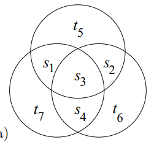

## Part 1: How do we deal with communicating under noise?

For the majority of electronic systems, and other information dense systems, a prevailing theme has been that the real world is chaotic. While we would love to have some digital communication channel that gives all of our information to another party without fail, we know that this impossible, as every channel is *fundamentally noisy*. Even the most high-quality disk drives, for example, have high enough error rates that simply having data normally stored would make modern computers infeasible. 

So - we're stuck with a nigh-impossible task. How can we get information passed when parts of our message is gone? The answer comes through one of the key ideas in information theory: *redundancy*. 

If we look at English, we can already see how our natural communication systems are fundamentally redundant. If I asked you to look at and understand the following sentence:

---

Thnks fr th dy, frnd! I enjyd t v mch.

---

You might be able to get out that I'm really just saying "Thanks for the day, friend! I enjoyed it very much.", even though I removed a lot of the characters from the code. By adding some redundancy, we can maintains systems that do not degrade against the noise, and it turns out we can do similar things in the mathematical sense through Information Theory.

If we were to abstract this process, we could picture it as the following system:

$$\text{Source} \rightarrow \text{Encoder} \rightarrow \text{Noisy Channel} \rightarrow \text{Decoder} \rightarrow \text{Destination}$$

The idea here is that, instead of trying and failing at getting information through the noisy channel as-is, we pull a computer science major and abstract away our problems through an arbitrary "encoder", which will somehow handle adding redundancy, and an arbitrary "decoder" which, under some forms of noise, be able to correct the noise or at least tell that the message is uninterpretable, allowing the source to resend the message again to the destination. 

With this understanding, we now turn to IT, which hopes to understand "To what extent can these systems do their job?"

---

### Error-correcting codes for the binary symmetric channel

With the main idea under way, we can start messing around and trying to mathematize this process, experimenting until we figure out how to get the most information out of such a system. 

Firstly, we'd like some mathematical model of the noisy channel. This serves to both allow us to gauge if a scheme of repetition works well, but also allows us to **rank** systems depending on how much noise they can tolerate. The simplest way to do this is through a binary symmetric channel:

---

A **Binary Symmetric Channel,** is a channel where each bit of information is transmitted with probability f and changed with probability 1-f. More formally, if y is the output of the channel and  x is the input:

$$P(y=0| x=0) = 1-f; P(y=0|x=1) = f\\ P(y=1|x=0) = f; P(y=1|x=1) = 1-f$$

---

In terms of interpreting this, we know that f=0.5 would be an impossible challenge to tackle, as every bit would simply devolve into noise, while f=1 or f=0 would be perfect channels, as we could simply map a 1 to 1 correspondence between output and input and get the information out accordingly.  Our goal, then, is to find good codes for all other cases, so we can transmit information cleanly in all other noise values. 

The simplest way to do this, of course, is to simply add repetition directly through a so-called "Repetition Codes": Instead of transmitting one copy of the bit in question, we send two, three, or even three thousand copies of the bit along, and then use majority vote to get the information across. It's obvious, but it gives us a baseline for future information, so it's very important.

Even though a majority-vote seems obvious, the book then spends some time proving that the intuition serves reality. How? Through maximizing probabilities.

After all, our goal is to maximize the decoded probability of our end symbol, s hat, given the received sequence, r. 

Through Bayes' Theorem, we can decompose the result in the following manner:

$$P(s|r_1r_2r_3) = \frac{P(r_1r_2r_3|s)P(s)}{P(r_1r_2r_3)}$$

where r_i is the value of digit i of our received sequence, and s is the probability to have s as some value. 

Thus, for both potential cases of s, we have the following:

$$P(s = 1|r_1r_2r_3) = \frac{P(r_1r_2r_3|s = 1)P(s = 1)}{P(r_1r_2r_3)}$$

$$P(s=0|r_1r_2r_3) = \frac{P(r_1r_2r_3|s=0)P(s=0)}{P(r_1r_2r_3)}$$

These probabilities are known as the *posterior probabilities*, which let us determine how to decode something given the output of a noisy channel. These depend on the *prior probability*, P(s), which let's us know the probability of choosing some symbol in our input language, and the data-dependent term, P(r1r2r3|s), which is the *likelihood of s*

Now, for the sake of "showing" this algorithm, we'll make two additional assumptions: 1) That the probability of getting s=0 is the same as s=1, so P(s) = 0.5 on both accounts, and 2) That the channel is a binary symmetric channel with f < 0.5, so we don't need to worry about flipping all of the bits before deciding anything. 

With all of this settled, then the likelihood is the following:

$$P(r|s) = P(r|t(s)) = \prod^{N}_{n=1}P(r_n|t_n(s))$$

where P(r_n|t_n) is (1-f) in the case the output agree with the input, and f in the opposite case. 

Thus, the ratio of the probability that we get r if we inputted s as 1 versus the probability that we get r if we inputted s as 0 is:

$$\frac{P(r|s=1)}{P(r|s=0)} = \prod^{N}_{n=1}\frac{P(r_n|t_n(1))}{P(r_n|t_n(0))}$$

As this ratio is only > 1 in cases when s=1 is more likely than s=0, we can use that, and the fact that f < 0.5, to then show that the above symbol sets are the only ones that make sense for our case. 

With all this proven, let's now try to figure out the error probability of this code in general. To do so, we wish to find the probability of the following:

$$P(\hat{s}=1|s=0)$$

as this is the error probability in general as its the only one of two possibilities, with equal chance of either symbol. 

To calculate this, let's go through some casework:

$$P(\hat{s}=1|s=0) = P(\hat{s}=1|s=0 \land r=111)*P(r=111|s=0) + \\ P(\hat{s}=1|s=0 \land r=011)*P(r=011|s=0) + \\ P(\hat{s}=1|s=0 \land r=110)*P(r=110|s=0) + P(\hat{s}=1|s=0 \land r=101)*P(r=101|s=0)$$

Obviously, as our encoding schemes are deterministic, the conditional probabilities on our received vector are all 1, so we really have the following:

$$P(\hat{s}=1|s=0)=P(r=111|s=0) + P(r=011|s=0) + P(r=110|s=0) + P(r=101|s=0) \\ = f^3 + 3f^2(1-f) \\ = 3f^2 - 2f^3 \\ \approx O(f^2)$$

Thus, here especially, we know that the probability of error scales with f^2, which is not too bad (f = 0.1 → an error rate of 0.03 ish), but it's also not too great either, as we literally have to send THREE times the data in order to reduce the probability of error marginally. 

Additionally, for sellable drives and good channels, we need probabilities of around 10^-15. Thus, we'll need a lot more repetitions. To figure out how many, let's take a look:

So, again, we know that the error rate is simply the probability that more than half of the digits of a code flip, as the decoder is fully deterministic. To calculate this, then, we simply need to sum up the following probabilities:

$$P(error) = \sum^{N}_{n=(N+1)/2} P(r \text{ has } n \text{ bits of the other digit })$$

Obviously, the probability of each digit flipping is f, and the probability of each digit staying the same is 1-f, so we end up with:

$$P(error) = \sum^{N}_{n=(N+1)/2}{N \choose n}f^n(1-f)^{N-n}$$

as we need to account for all potential (flipped-unflipped) combinations. 

However, unlike the equation before, for N=3, we cannot really tell how the end result of this computation. So that we can better determine what's going on, let's get some concrete numbers into this - namely f=0.1. 

In this case, I'd have to guess what the largest term is. In general, it'd be the term where the minimum number of bits are flipped to cause the change in question. 

If we use Stirling's approximation, we can start approaching this more programmatically through the following approximation:

$$2^{NH_2(n/N)}f^{(N+1)/2}(1-f)^{(N-1)/2}$$

As the binary entropy is maximized when n is about 0.5, the actual term is approximately the following:

$$2^N(f(1-f))^{N/2} = (4f(1-f))^{(N/2)}$$

Thus, the exponent changing with sqrt(N). With this, we get that we need 68 repetitions to get the error probability low enough. However, this is INSANE. We'd need 68GB of memory to store 1GB of memory without any problems, and the repetition there would slow down modern storage a lot. So can we do better? Yes. Much. Much. Better. 

We can do so by encoding **blocks of data** rather than singular bits of data. 

---

### Block codes - the (7,4) Hamming code

As we can see, the obvious approach really seems quite bad. We wish to communicate with minimal error, but not without losing too much speed. So, we do this by trying to encode blocks of data rather than simple bits. While this seems stupid, as surely the repetition code would allow for the most redundancy, that is completely incorrect.

Before we do so, let's first have some quick definitions:

- **Block Codes**: A rule for encoding a series of source bits, **s**, of length **K** ,to a transmitted sequence **t** of *N* bits, with *N > K* so we can have redundancy.
- **Linear Block Codes:** We add *N-K* bits that are linear functions of the original bits, which we send without modifications. We call these added bits "parity check bits", as they allow us to check that there are an odd or even number of bits in certain groups.

The (7,4) Hamming Code is one such example of a linear block code, which transmits N=7 bits for every K=4 bits. Pictorially, the encoding process looks like a Venn Diagram:

Here, if we place the source bits s1s2s3s4 into the Venn Diagram, we get the parity bits t5t6t7 are set so that the modulo 2 sum of the digits in each circle is 0. 

All of this fancy encoding allows for a really nice set of encoded bits per set of source bits, where each pair of source bits differs in at least 3 places with each other, which is a better guarantee than our original Repetition code ( where the minimum pairwise difference is in two locations ) , even though we used less bits overall. 

Additionally, the Hamming code is further benefitted by its status as a linear code, for one key reason: Matrices. 

As the word "linear" suggests, we can actually re-write this entire encoding process as a matrix. In fact, the transmitted codeword, **t,** is obtained from the source sequence, **s** , through the following equation for some matrix **G:**

$$t = G^Ts$$

Where G is given the title of a *Generator matrix* for the program, which for our problem is the following:

$$G^T = \begin{bmatrix}1 & 0 & 0 & 0 \\0 & 1 & 0 & 0 \\0 & 0 & 1 & 0 \\ 0 & 0 & 0 & 1 \\ 1 & 1 & 1 & 0 \\ 0 & 1 & 1 & 1 \\ 1 & 0 & 1 & 1 \\ \end{bmatrix}$$

Where all addition operations are, of course, modified to be modulo-2 arithmetic and s and t are column vectors.

### Decoding the (7,4) Hamming Code

Now, with the encoding process all written out, a more interesting question comes about: How the heck are we going to decode this? After all, we have no idea what bits are going to be flipped, and those bits could be our parity bits. 

The obvious idea here is to find the codewords that require the fewest inversions to take our output and transform it back into our input. After all, if we can do this successfully, we can be relatively sure that this will be the best guess, as the probability of flipping a bit compared to that bit staying is relatively small.

However, this idea is really inefficient. Without some tweaks, calculating the bitwise difference is a lot of constant-time steps, and no one would want to do that for longer and longer Hamming codes, where the number of combinations to check explodes exponentially.

So - how the heck do we decode the (7,4) Hamming Code in such a way that not only preserves our current sanity, but in a way that scales well to larger and larger codes? The answer is to use the parity checks to our advantage through "syndrome decoding". 

---

### Syndrome decoding for the Hamming code

To explain the idea behind a syndrome, let's go back to the Venn Diagram of the decoding algorithm.

When we put in our received noise-perturbed vector, we can see that some of the circles now have non-even parity, violating our original basis for the bits. Thus, something in those circles must be what caused the bug, and thus we can decode our code based on these *syndromes*, or based on what set of circles lose their parity matching.

As there is a 1-1 correspondence between each 1-bit change and the corresponding syndrome, we can use syndromes to tell us what bits we need to switch and what we need to do then, thus easing on our computational struggles.

For example, if all three circles' syndromes fail, then we know that the center bit is the most likely bit to be off, so we flip it. In doing so, we can correct for ALL 1-bit errors in communication, with less extra data than the simplest repetition code. SUCESS!

---

However, while syndrome decoding is optimal for our linear block Hamming code, it currently also has a very major problem - it cannot notice or help against 2-bit errors. If we change two bits, our code simply flips the failed syndrome, turning a 2-bit error to a 3-bit error without our program noticing. So, while Hamming codes are optimal, we need to improve this code a bit before it can be used in a production system. 

---

### Making Syndrome Decoding Mathematical: Or Speedy Fast Code Makes Me Happy

Now, again, while syndrome decoding is definitely the faster way to handle this form of communication, it still can be faster through the magic of matrices. As computers can handle matrix multiplication very well, and as matrix multiplication is a heavily researched problem in modern computing, if we could somehow turn our decoding procedure into a sequence of matrix operations we could probably speed up our processing speed, making everyone* happier

**See: Shareholders

So, how do we manage to make this magic happen? We use base-2 addition and multiplication very cleverly. 

Now we know that each circle corresponds to one bit of the syndrome, and that, if each syndrome is satisfied, then the base-2-sum of every member in every circle must be 0. 

With this information, we can then ask - what if we simply just use matrix multiplication to calculate the base-2-sum of each of the 4 elements in each circle? If we manage to do so, then we can simply reference this set of three bits to see what bit needs to be flipped to fix our error, as each syndrome points to a unique error **without knowledge of the current codeword**. So, if we simply add a lookup table, and compute our syndromes accordingly, we can make for a really nice algorithm that scales to larger systems. 

To calculate the syndromes using a matrix, we'll first need to define a few matrices.

Firstly, we'll define a 3x4 matrix P such that:

$$G^T = \begin{bmatrix}I_4 \\ P\end{bmatrix}$$

Here, I4 refers to the identity matrix, and P refers to the unique parity checks chosen for our specific Hamming code. This will defer depending on which of the many but similar (7,4) Hamming codes we choose, so it's important that we keep this arbitrary.

Secondly, then, we'll define the *parity-check matrix* H, which serves as our syndrome calculation engine:

$$H = \begin{bmatrix}-P & I_3\end{bmatrix}$$

For our (7,4) Hamming code, this becomes the following:

$$H = \begin{bmatrix}1 & 1 & 1 & 0 & 1 & 0 & 0 \\0 & 1 & 1 & 1 & 0 & 1 & 0 \\ 1 & 0 & 1 & 1 & 0 &0 & 1\end{bmatrix}$$

This matrix, when multiplied by our transmitted vector, gets us our syndrome, z:

$$z = Hr$$

Thus, we get a really optimal code that manages to optimally correct all 1-bit errors, and we do it in manners that are not only computationally straightforward, but are computationally "trivial" to do / use someone's optimized code to do.

## Error-correcting codes for the binary symmetric channel

Now that we've started digging deeper into this idea of encoding, we can better understand what's happening and start delving deeper into it. 

We define a *decoding error* to be a situation where the four decoded bits do not all match the source bits of the program. As we're hoping to better understand the performance of this code in the context of our binary symmetric channel, we'll need to define a new error probability, the *probability of block error*, pB:

$$p_B = P(\hat{s} \neq s)$$

This refers to the probability that one or more of our decoded bits fail to match the corresponding source bits, demonstrating our encoding error. 

However, if we wish to talk about specific bits, so we can compare this code to our earlier bit-based example, we're really looking for the *probability of bit error* pb, which refers to the average probability that a decoded bit fails to match the corresponding source bit:

$$p_b = \frac{1}{K}\sum^{K}_{k=1}P(\hat{s}_k \neq s_k)$$

Which, while it makes sense, is still better to define formally for the sake of formal analysis. 

Now, in this Hamming code, a decoding error will happen whenever more than a bit in a block of 7 gets flipped. This probability of decoding error is O(f^2), as the chance of the bit flipping is assumed to be less than the probability of the bit remaining. 

With this, we've managed to get the same general performance as our R3 code in terms of error, but we've also managed to communicate with faster rates, only wasting 3/7 of the data we send so that we can get the same performance as before - a truly remarkable result, for something so simple, and a testament to how the simplest encoding strategy is really, really bad for our purposes.

---

## 1.3: What performance can the best codes achieve?

While generalized linear block codes are great, they do run into the same asymptotic troubles we run into for repetition codes. They're a great way to make things better, but they do not change the fact that we need a lot of data to make our codes have useful low error probabilities, and we thus run into the same situation as last time. 

So - what's a programmer to do in these trying times?

What sorts of (decoded bit-error probability, information sending rate) combinations can we reasonably expect to get at, as we can't send data perfectly along a channel?

It turns out this is a relatively solved question in Information Theory, through the work of a Claude Shannon in a paper from 1948, where he did the power play of literally creating a field (Information Theory), and then solving most of the fundamental problems with it, in a single paper. Truly a madman. 

It was largely believed, before, that the combinations of (decode error, rate sending) passed at a curve through the origin, with the idea that, in order to send perfect information in an imperfect world, you needed practically infinite data. After all, this belies with common sense; nothing's perfect, and getting perfect performance should reasonably expect some perfect penalties as a result. 

However, in a move that shows Shannon's brilliance, he probed that there exists code that communicate with arbitrarily small probabilities of error while still allowing non-zero communication rates, a result known as the *noisy-channel coding theorem*. 

This literally seems to state we CAN, for once in CS, both have our cake, eat it too, and maybe even have enough to share with others. It violates all common sense, and the goal of IITLA, at least for the first half, is to make this stupidly absurd result less so, with a sprinkle of amazing maths in between.

These are not only mathematical results with poor real-world applications either, a common trope among some of the more elegant theorems in math. This theorem shows that there are some stupidly decent results we can achieve, without causing massive problems. 

To do so, we'll end this section off by defining one last concept: the **capacity** of a channel. This serves as the maximum rate at which communication is possible with arbitrarily small decoding error probability. The formula for it, termed C(f), for some binary-channel flip error rate of f, is the following:

$$C(f) = 1 - H_2(f)$$

where H2(f) is the binary entropy function:

$$H_2(f) = [f\log_2\frac{1}{f} + (1-f) \log_2\frac{1}{1-f}]$$

We'll get into what this means later, but for now, let's plug in our 10% error rate, f=0.1, and see that we get a maximum capacity around 0.53. 

So, according to Shannon, to get a really good disk drive with 10^-15 or smaller error rates, we do not need 3,4, or 60+ disk drives to store it all, we only need 2 disk drives in total. Furthermore, these are NOT existence results, but are in fact have codes attached - so we can actually get these results IRL, and not just say they exist somewhere in math-space. Truly a remarkable piece of mathematics.